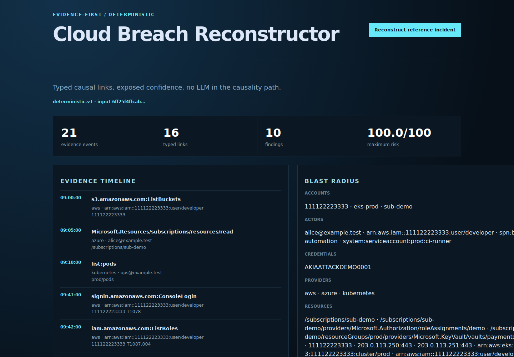

# cloud-breach-reconstructor

An evidence-first engine that ingests AWS CloudTrail, Azure Activity Log,
Kubernetes audit, and normalized flow records, then reconstructs a temporally
valid incident graph. Every link exposes the exact correlation rule, evidence,
observed time delta, configured time bound, and confidence used to create it.

The language-model boundary is deliberate: **no LLM decides causality, ATT&CK
mapping, blast radius, or containment**. A language model may later rewrite the
deterministic JSON into prose, but it cannot add events or relationships.

## Running example



The reconstructed attack timeline and evidence links from the reference cloud-log dataset. [Commands and test results](docs/verification.md).

## Measured reference incident

The committed cross-cloud lab contains 21 records: two labeled attack chains and
three benign distractors across AWS, Azure, Kubernetes, and flow telemetry.
The [committed 100-run benchmark](datasets/reference/benchmark.json) reports:

| Evidence | Result |
|---|---:|
| Expected / reconstructed causal links | 16 / 16 |
| Causal edge precision / recall | 100% / 100% |
| False-link rate | 0% |
| Finding precision / recall | 100% / 100% |
| ATT&CK-event precision / recall | 100% / 100% |
| Technique precision / recall | 100% / 100% |
| Functional output digests across 100 runs | 1 |
| Local median / p95 latency | 1.583 ms / 2.867 ms |

These are synthetic-lab measurements, not production accuracy or throughput
claims. Latency varies by host; functional fields exclude the generation clock.
The benchmark validates edge types, findings, mapped event IDs, techniques, and
explicit false positives and negatives. It never uses the fixture's `label`
attribute as a detection signal. The 100 functional outputs produced one digest:
`a87e29e5d4bd…`.

## Architecture

```text
CloudTrail / Azure Activity Log / Kubernetes Audit / flow JSON
                              |
          strict normalization + canonical-record SHA-256
                              |
        deduplication and conflicting-evidence rejection
                              |
      scoped, typed causal rules with strict time precedence
        | explicit parent       | credential lineage
        | workload identity     | request correlation
        | session sequence      | resource mutation/use
                              |
              cycle-checked event DAG + confidence
                              |
    findings / ATT&CK / incidents / blast radius / containment
                              |
 JSON + timeline CSV + DOT + executive/technical reports + API
```

See [Architecture](docs/ARCHITECTURE.md), [Methodology](docs/METHODOLOGY.md),
[Threat model](docs/THREAT_MODEL.md), and [Limitations](docs/LIMITATIONS.md).

## Quick start

The runtime is Python 3.10–3.12 and has no third-party dependency.

```bash
python -m venv .venv
. .venv/bin/activate
python -m pip install -r requirements-build.lock -r requirements-dev.lock
python -m pip install --no-build-isolation --no-deps -e .

cloud-breach validate datasets/lab/events.jsonl
cloud-breach analyze datasets/lab/events.jsonl --output out/reference
cloud-breach benchmark datasets/lab/events.jsonl \
  --truth datasets/lab/ground-truth.json --iterations 100 --fail-under 1.0
cloud-breach serve --host 127.0.0.1 --port 8080
```

The analysis bundle contains canonical evidence, a formula-neutralized CSV
timeline, an escaped Graphviz causal graph, executive and technical reports, and
a SHA-256 manifest. The installed wheel embeds the inert lab evidence, so the
dashboard demo works outside a repository checkout.

For a constrained runtime:

```bash
docker compose up --build
```

Compose binds to loopback, runs as UID 10001 on a read-only filesystem, drops all
Linux capabilities, enables `no-new-privileges`, and caps CPU, memory, and PIDs.

## Input formats

- AWS records are identified by `eventTime` + `eventName` and preserve event ID,
  request ID, identity/access key, source address, account, resource, result, and
  issued credentials.
- Azure records preserve event data ID, correlation ID, caller/claims, operation,
  resource, subscription, status, address, and issued identities.
- Kubernetes audit records preserve audit ID + stage, timestamps, user, verb,
  object reference, response, source IP, and namespaced annotations used by the
  controlled lab.
- The versioned normalized schema makes flow telemetry and deterministic fixtures
  explicit without pretending they are native provider logs.

JSONL and `{ "events": [...] }` JSON are accepted. Normalized records require
`schema_version: "1.0"`. Duplicate keys, non-finite numbers, nesting deeper than
64 levels, timezone-free timestamps, conflicting duplicate IDs, oversized
records, unknown formats, and unsupported outcomes fail closed. The field
`canonical_record_sha256` binds normalized JSON semantics; it is deliberately
not presented as a hash of the original byte stream or a chain-of-custody proof.

Official semantics used by the adapters:
[AWS CloudTrail record contents](https://docs.aws.amazon.com/awscloudtrail/latest/userguide/cloudtrail-event-reference-record-contents.html),
[Azure Activity Log schema](https://learn.microsoft.com/azure/azure-monitor/platform/activity-log-schema),
[Kubernetes audit API](https://kubernetes.io/docs/reference/config-api/apiserver-audit.v1/),
and [MITRE ATT&CK Cloud matrix](https://attack.mitre.org/matrices/enterprise/cloud/).

## API

| Method | Path | Purpose |
|---|---|---|
| GET | `/api/v1/health` | Engine mode and liveness |
| GET | `/api/v1/demo` | Reconstruct the immutable lab evidence |
| POST | `/api/v1/reconstruct` | Reconstruct exactly `{ "events": [...] }` |

The API is stateless, accepts at most 2,000 events / 5 MB per request, caps JSON
depth and request-body time, rejects extra fields and duplicate keys, emits
restrictive browser headers, and has no outbound network or process-execution
surface. It remains a local demonstrator; shared deployment requires an
authenticated TLS reverse proxy.

## Quality gates

```bash
make test
make quality
make benchmark
```

CI runs Python 3.10, 3.11, and 3.12, strict Ruff/mypy checks, branch coverage,
fixture integrity, ground-truth metrics, deterministic replay, report tests, CLI
and API E2E tests, isolated wheel/sdist smoke tests, Compose validation, and an
unprivileged read-only container benchmark. Actions and base images are pinned
by immutable digest.

## Security and honesty

This tool accelerates triage; it does not replace provider-native forensic
collection, legal preservation, or an analyst. Confidence is rule confidence,
not a calibrated probability. The lab uses documentation-only IP ranges and the
reserved `.invalid` domain. See [SECURITY.md](SECURITY.md) before reporting a
vulnerability and [Limitations](docs/LIMITATIONS.md) before interpreting results.

## License

MIT — see [LICENSE](LICENSE).
